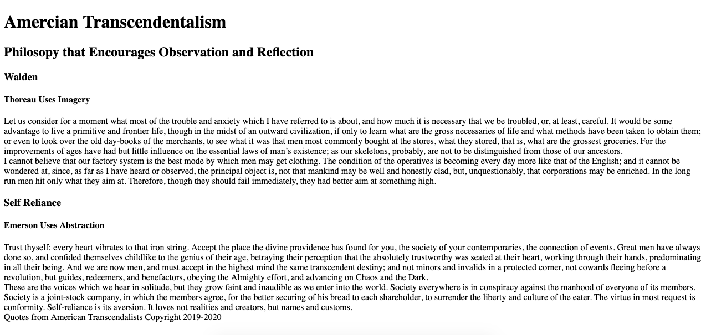

# Requirements
## HTML: Structure and Semantics

### Using Semantic HTML

In the early days of web development, we only had the non semantic block and inline containers (`div` and `span`) to work with.  As the need for HTML code maintance grew and with publication of the first spec for CSS in 1998, we found a need to make HTML more readable and the structure more meaningful.  With creation of screen readers, the need for meaningful HTML became even more critical.  The spec for HTML 5 came out in 2014 and introduced a collection of semenatic tags.  You can find a summary here: [HTML 5 Semantic Tags](https://www.w3schools.com/html/html5_semantic_elements.asp)
Today as we better understand the needs for users and our industries desire to provide usable websites, we look for ways write code that improves accessibility.  Semantic HTML is one of the recommended methods of improving Web Accessibility.  You can read more hear about the [markup spec and web accessibility] (https://www.w3.org/WAI/WCAG21/Techniques/).

### Use the following tags to create a web page that is sematically correct based on the content. 

header, h1-h6, footer, section, article, p

Be sure to validate the HTML using https://validator.w3.org/

### Content
title: Quotes from American Transcendalists

header: Amercian Transcendentalism

header: Philosopy that Encourages Observation and Reflection

main: 
section 1: 
header: Walden

header: Thoreau Uses Imagery

article 1: 
paragraph: Let us consider for a moment what most of the trouble and anxiety which I have referred to is about, and how much it is necessary that we be troubled, or, at least, careful. It would be some advantage to live a primitive and frontier life, though in the midst of an outward civilization, if only to learn what are the gross necessaries of life and what methods have been taken to obtain them; or even to look over the old day-books of the merchants, to see what it was that men most commonly bought at the stores, what they stored, that is, what are the grossest groceries. For the improvements of ages have had but little influence on the essential laws of man’s existence; as our skeletons, probably, are not to be distinguished from those of our ancestors

article 2: 
paragraph: I cannot believe that our factory system is the best mode by which men may get clothing. The condition of the operatives is becoming every day more like that of the English; and it cannot be wondered at, since, as far as I have heard or observed, the principal object is, not that mankind may be well and honestly clad, but, unquestionably, that corporations may be enriched. In the long run men hit only what they aim at. Therefore, though they should fail immediately, they had better aim at something high.

section 2: 
header: Self Reliance

header: Emerson Uses Abstraction

article 1:  Trust thyself: every heart vibrates to that iron string. Accept the place the divine providence has found for you, the society of your contemporaries, the connection of events. Great men have always done so, and confided themselves childlike to the genius of their age, betraying their perception that the absolutely trustworthy was seated at their heart, working through their hands, predominating in all their being. And we are now men, and must accept in the highest mind the same transcendent destiny; and not minors and invalids in a protected corner, not cowards fleeing before a revolution, but guides, redeemers, and benefactors, obeying the Almighty effort, and advancing on Chaos and the Dark.

article 2:  These are the voices which we hear in solitude, but they grow faint and inaudible as we enter into the world. Society everywhere is in conspiracy against the manhood of everyone of its members. Society is a joint-stock company, in which the members agree, for the better securing of his bread to each shareholder, to surrender the liberty and culture of the eater. The virtue in most request is conformity. Self-reliance is its aversion. It loves not realities and creators, but names and customs.

footer:  Quotes from American Transcendalists Copyright 2019-2020

### Final Image

