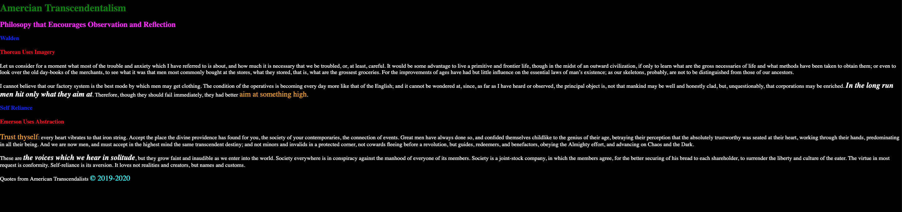

# CSS: Adding Style

## Add Style 3 Ways

External stylesheet

Internal style tag

Inline style attribute

## Experiment with CSS selectors
HTML tags
id
class

## Exeriment with CSS Properties
color
background-color
font-size
font-style
font-weight

#### Instructions

Copy the `index.html` file from `1-htm-semantics-structure` directory into the `2-css-inheritance-specificity directory`.

Create a new directory called **css** containing a new file called **style.css**. Use the `link` tag to link the css to the index.html.  This will serve as your **external style sheet**.

Create a style tag in within the <head> of the index.html. This will serve as your **internal style tag**.

Add styles:
  1. Make the default background color black and the font color white for the page by specifying the body selector and using `background-color` and `color` properties in the external style sheet.   
  1. Make all headers (`h1`-`h6`) red by default in the external style sheet.
  1. Create a `span` tag style in the external style sheet in which the font `color` is orange and the font size is `1.5rem`.  `span` is a nonsemantic style like `div`.  `span` is inline by default where as `div` is block by default.  Inline styles render horizontally and Block styles render vertically.  `span` is useful for applying font styles because it doesn't interrupt the flow of the text.  Wrap the text "aim at something high" and  "Trust thyself" in span tags so that they take on the style specified by the `span` selector.
  1. Within the internal style sheet specify h2 and h3 should have the color blue.
  1. Add an inline style attribute to the `h1` tag specifying that the color should be green.
  1. Add an inline style attribute to the `h2` tag specifying that the color should be fushia.
  1. Replace the word copyright in the footer with an **html entity** `&copy;`.  HTML entities allows us to represent characters that are not on the keyboard. They can be style like other characters. Wrap the copyright and dates in a `span` tag with a `id` attribute of "copyright".  1. Then create an entry in the external stylesheet that uses a `#copyright` selector.  Style the copyright span the color `aqua`.  Each named `id` on a web page is expected to be unique.  We therefore don't usually style with `id` but it you are allowed to and we do it here for purposed of comparing the the attribute `class` whose names can be used in multiple places through the file. Why are we adding a copyright where we are using content in the public domain created by other people? We are copyrighting our webpage to indicate that we have created the idea of quoting American Transcendalists in this way.
  1. Wrap "In the long run men only hit what they aim at" and "the voices we hear in solidtude" with a `span` tag and provide a class attribute of "important".  Then create an entry in the external stylesheet that uses an `.important` specifier and add a font style of italic, a font weight of bold and a color of white.

  NOTE:  If you've followed the requirements you will have a colorful and not very readable document. In general we want all of the styles to be recorded in an external style sheet, meaning no internal style tags and no inline style attributes.  We also do NOT to want to use id's or tag names as selectors.  The fact is that we want conventions to win over allowed configurations.  It's sometimes useful to break convention in the interest of experimentation. 

## Solution

