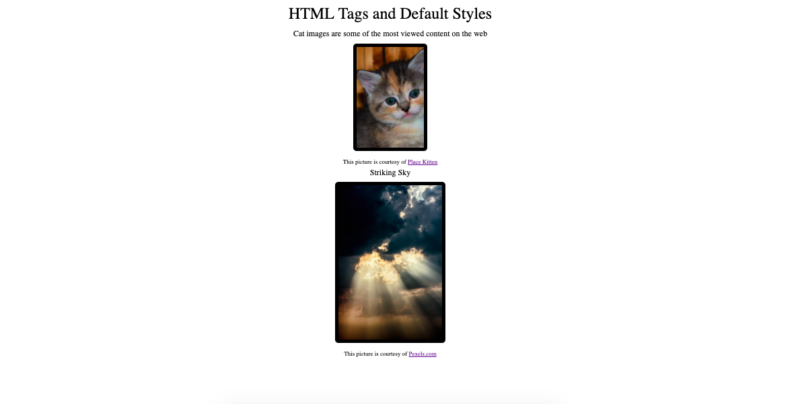

# HTML Tags
Box Model: margin, padding, border, content

Explore the way browsers render some HTML tags by default 

Notice that some tags are designed to **contain** content while others are designed to *import* it from external locations.  The tags that contain content have "closing" tags.

Use the browser inspector tool to view margin, padding, border, content

Use a style sheet the "normalizes" or "resets" browser default styles

This code loads images using the `img` tag. When using the `img` tag its important to include and `alt` attribute with the tag.  This attribute provides a text description of the image.  Just like using semantic HTML to improve accessibility we want to include a textual description that will be displayed by the browser in case the image doesn't load, the user is using a screen reading and can't see the image or the bandwidth or device size needed to display the image isn't suffienct to present it properly.

https://meyerweb.com/eric/tools/css/reset/

1.Explore the elements of the rendered index.html file using the Chrome Dev Tools element inspector.  Track down the use source of styling for the default styles.  Look in particular at height, width, margin and padding.  
1 .Link the provided style sheet `reset.css` into the index.html using the `link` tag. Have a look at the styles provided in the reset and try to predict the effect they will have on the tags in the index.html. Resets are used by designer to negate the effect default style because different browsers can have different defaults. Inspect the rendered code after adding the reset.   
1. Create a new `style.css` and link below the `reset.css` file. (Why below?)  Add html or styles to improve the look of reset page.
  - Replace the <div> with an `h2`.  Is is OK to have 2 `h2` tags on a page? Is it OK to have 2 `h1` tags on a page?
  - Use `h2` instead of `p` for the "Striking Sky" text
  - Add a `p` tag around the text next to the clouds-dark-dramatic picture
1. The  kitten picture size is supplied by the 200/300 parameters in the URL. The clouds-dark-dramatic image has assumed it's default "natural" size.  You can find this size by inspecting.  We find it to be 1280x1920.  This is a width x height size in pixels.  We want to resize the large picture but in order to do this without skewing it, we have to keep the same ratio of width to height.  The easiest way to to divide width and height by the same value.  The height of a laptop screen is about 1280 x 800 pixels depending on resolution  If we want the picture to be half the height of the screen, we need to reduce the height to around 400. I'll divide the images natural dimensions by 4 and set the height and width to 320 x 480.  This size can be changed in `height`/`width` attributes or in a style sheet.  In general it is better not to restyle images with style and attributes, but to crop them to the desired size.  
1. Add a new style sheet and apply styles to the elements on the page.
  - for the `h1` set font size to 3em and margin to .5 em.  An `em` is a unit that is approximately the size of the letter m for the default font-size.
  - for the `h2`set the font size to 1.5em and the margin to .3 em.
  - for the `p` set the padding to 10 `px`.  Pixels are depending on resolution but are exact where as the `em` is relative.  Notice the different between apply padding vs margin to an element.  Padding provides space between the content and the boundary of the element whereas margin provides space between the element and it's sibling element. If there's only block element on a line it's difficult to see the difference, but you can see it with dev tools inspector.
  - for the `img` provide a margin of 10px
  - for the `figcaption` provide a margin of 10px
  - Create a `div` with a class of `container` that surrounds all the content.  We'll use this to center the content on the page.  Create a `.container` class and give it the following properties ```.container {
  margin: 0 auto;
  text-align:center;
}```  
1. Add border to the images
  - Apply border styles
    - border radius 10 px
    - border color black
    - border width 2px
    - shortcut ``` border: 1px solid black;```
    - box-sizing ` box-sizing: border-box;`  Border box allows padding and border to be part of the content width instead of adding additional width.

#### Notes ####
What do block tags give us that inline tags don't in terms of styling?  Block tags have a vertical dimension and therefore we can add height and vertical (top/bottom) margins to block items but not to inline items. You can add width to inline elements without generating an error, but the width will never exceed the width of the content.  When you add width to a block element, the content will contain space. 

https://www.w3resource.com/html/HTML-block-level-and-inline-elements.php


https://developer.mozilla.org/en-US/docs/Web/HTML/Block-level_elements
https://developer.mozilla.org/en-US/docs/Web/HTML/Inline_elements

https://codeburst.io/block-level-and-inline-elements-the-difference-between-div-and-span-2f8502c1f95b

full tag reference: https://www.w3schools.com/tags/default.asp

Exmaples of block tags:
- div
- ul
- li
- h1 - h6 
- ol and ul
- pre and blockquote

Examples of inline tags:
- span
- a 
- img The image tag is unusal in that it renders inline but it allows us to provide height

If you only supply one measure to the margin property it applies to top, right, bottom and left.  If you supply two measure the first applies to top and bottom and the second applies to right and left.  By making the top/bottom equal to 0 and the right/left auto we effectively apply equal margins to right and left and don't effect top and bottom.  Then you apply center the text alignment and the page will appear fully center.  This is a very simplistic but effective layout.  

Many developers add `box-sizing: border-box` to their reset style sheet because it makes sizing elements for layout more intuitive: you can think of an elements size based on the combination of content, padding and border, instead of always having to make that extra calculation. See https://www.w3schools.com/css/css3_box-sizing.asp and https://css-tricks.com/box-sizing/

Note that CSS provides shortcuts for applying properties to some cateogries of styling.  For example with border instead of  
```
border-style: solid;
border-width: 2px;
border-color: black;
```  
you can use 
```  
border: 10px solid black;
```
There are shortcuts for font, background, margin, padding to name a few.
see http://www.landofcode.com/css-tutorials/css-shortcuts.php
https://developer.mozilla.org/en-US/docs/Web/CSS/Shorthand_properties


### Final Image

 


