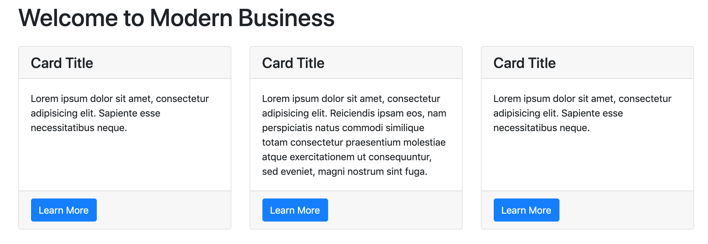
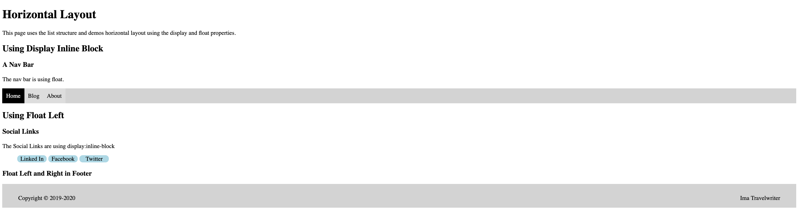

  
  # Horizontal Layout

We want to be able to put content side by side on the page.  Until now we've just seen that we can render inline with *inline* tags like `span` or to the next line with *block* tags like `div` and our many semantic tags.  Content has stacked vertically until now.  

As we move into more advanced layouts the concept of nesting tags becomes important.  We'll speak of parent and child containers as we code HTML in such a way that tags surround other tags.  This allows for interaction between the styling of parent and child.

In this assignment, we'll use some techniques for horizontal layout that are still in use but rapidly being replaced by new properties that we'll explore in future assignemnts.  Specially we'll use 
- `float:left`
- `display:inline-block`
- `position:relative` with `position:absolute`.

## Introduction to Anchor Tags
We saw anchor tags `<a>` in the box model tutorial where they were used to give credit for the pictures in the footer of the page.

When you talk about **the Web**, you are talking about a lot of documents connected to each other.  Anchor tags provide a lot of that connection. 

Anchor tags create interactive elements which means that when you click on them, the browser wants to do something and its instructions come from the contents of the `href` attribute. The `href` contains a URI which can be a filename in the same web root as the html file or a file on the internet. The `href` can also be blank and then clicking on the link will refresh to page.  If the `href` contains a hash `#`, the user will be taken to the top of the current page. We'll learn more in future tutorials about URI's that start with `#` as they are internal links.  
 
## Introduction to List Elements
Lists are important for web developers and programmers in general.  HTML supplies several ways to make lists and the list tags are: the ordered list which will render numbered items by default `ol` and the unordered list `ul` which will render items preceded by a bullet point by default.  Both `ol` and `ul` serve as containers for the list item `li`.  

Lists are a favored structure for web devs because there are many style properties that can be applied and they are  semantic as well.  We'll use the `display: inline-block` property and value to force our `li` items to render in a horizontal line but maintain their ability to be styled with height and margin. Remember that block elements allow us to assign height properties and they consume the entire horizontal line that they are on.  The `inline-block` value for the `display` properties gives us the best of both worlds.  

We'll also use the `float:left` proerty/value to cause our list items to line up starting at the left of the document.  Finally we'll use `position:relative` and `position:absolute` to cause a couple of `div` tags to pull the the left and right in a footer. When using `float:left` or `float:right` you can think of the elements to which this property is applied as floating around in the container that holds them.  In fact multiple block elements can be floated in single container and you can even float some to the left and some to the right.

see https://www.w3schools.com/cssref/pr_class_float.asp

The `display` property offers many options and we'll start with `block`, `inline`, and `inline-block` here.  You can see that CSS provides a way to make any element block or inline regardless of its default flow characteristic.  It also makes it possible to get the "best of both" with `inline-block`.

The `position` property offers a set of options for designating positions in the document. We'll use position in conjunction with float and text-align to force two divs to opposite ends of the footer container. This means that the `footer` tag will be styled with `position:relative`.  In order to use the `position` property, you must take the element out of the normal flow.  You'll see, in many situations, that this is done by applying the `position:relative` to the parent element of the element you want to apply `position: absolute` to.  When you see lists of tiles, or cards on a webpage in which there is a button that is in the same location for each tile or card, it is most likely done by making the card container `relative` and the button `absolute`.




There are 5 position values:  
1. `static` which is the default flow somewhat the order in which the html has been coded.
2. `fixed` which allows you to place the element on the document window specifying `top`, `right`, `bottom` and `left` in a separate property.  Values for position location represent distances from the side specified and can be in pixels, ems, rems, or percents.
3. `relative` is used to indicates a break in the flow of contents within the element given the relative position style.  Generally a container styled as `relative` will contain items positioned as `absolute`.
4. `absolute` positioning allows for the use of `top`, `right`, `bottom` and `left` properties like fixed.  The difference between `fixed` and `absolute` is that fixed is relative to the browser window and `absolute` is relative to the container it resides in.
5. `sticky` positioning provides fixed positioning even when the user scrolls so if you want your nav to remain at the top of the window, you can use `position:sticky; top: 0px`.


##  Requirements  

1. Add a style sheet to the index.html 
2. Style the **nav bar** using using `float:left`. 
3. Style the **social links** `display:inline-block`.
4. Style the **footer** contents using `position` properties.

### Nav Bar
There are 3 levels in the list heirarchy: the list, the list item and the anchor tag in the list item.

  1. The `ul` will clear margin and padding, set a background color to light gray, align text left, and set the list style type to none to remove the default bullets on the unordered list.  The nav tag (one of the semantic tags) is used for specificity because there are multiple unordered lists on the page.  When using floats we need to clear the float so the content following it returns to normal flow.  The `overflow:hidden` is one technique to do this. see https://webdesignerwall.com/tutorials/css-clearing-floats-with-overflow
   ```
 nav ul {
  background-color: lightgray;
  list-style-type: none;
  margin: 0;
  padding: 0;
  /*use overflow hidden to clear float*/
  overflow: hidden;
}
  ```  
  2. The `li`s are styled by floating them to the left.  
  ```
  nav li {
    float: left;
  }
```
  3. We style the anchor tag to remove the default underline on anchor links with text decoration set to none. We set the anchor tag to block to that its height expands to fill the parent `li`. We provide contrasting foreground and background color. Anchors tags have a pseudo selector called `hover` which we preface with a colon `:` when styling.  This pseudo tag allow us to introduce user interaction with out adding any JavaScript.  We set this up to change the background of the anchor tag to aqua when the user hovers over it. 
  ```
  nav li a {
    display: block;
    padding: 10px;
    color: black;
    background-color: #dddddd;
    text-decoration: none;
  }
  nav a:hover {
    background-color: aqua;
  }

```
- Finally mark the link that represents the content you're viewing as active.  You need to add `class="active"` to the home link and then specify contrasting colors for the active link.
```
nav li .active {
  background-color: black;
  color: white;
}
```

### Social Links with Display Inline-Block
There are 3 levels in social links.  For specificity be sure that the `ul` parent of the social links has the "social-link" class assigned. Note that the href attribute in the anchor tag for social links is taking the user to an external site.  Because of that an extra attribute value pair `_target="blank"` has been added with the affect that that link opens the page in a new tab.  This is to prevent the site from "losing" the user as they navigate away into a new website.

  - Set list style type to none on the `ul`
  ```
  ul.social-links {
  list-style-type: none;
}
```  
  1. Set the `li` to display with `inline-block` and provided a width, center text alignment and add color and border radius.  Use the `:hover` pseudoselector to color the background of `li` differently when user hovers.
  ```
  .social-links li {
    display: inline-block;
    width: 5rem;
    background-color: lightblue;
    border-radius:10px;
    text-align: center;
  }
  .social-links li:hover {
    background: gray;
  }
```
  2. Set up the color and hover changes for the anchor tag.
  ```
  .social-links a {
    color: black;
    text-decoration: none;
  }

  3. Style the text in the anchor tag.
  .social-links a:hover {
    color: white;
  }
  ```
### Footer with Position

We want to force two divs to render on the same line at opposite sides of the document.  This can be achieved by a combination of styles.  In a future assignment, we'll see another way that uses less code.  For this document we have 2 levels, one in which the semantic footer tag serves as the container which gets styled as relative.  The relative styling of the parents means we can provide absolute position for the children and two div tags.  

  - Add the relative position to the footer and provide some height and background color  
```
footer {
  height: 4rem;
  position: relative;
  background-color: lightgray;
}
``` 
  - Position each of the divs to the right and left using absolute position  
  ```
  .align-left {
  position: absolute;
  left: 2%;
  top: 45%;
}

.align-right {
  position: absolute;
  right: 2%;
  top: 45%;
}
```

## Resources 
 
  [nav bar using float](https://www.w3schools.com/css/css_navbar.asp)  
  [nav bar using inline-block](https://www.w3schools.com/css/tryit.asp?filename=trycss_inline-block_nav)

## Solution

### 3 techniques for horizontal layout  

