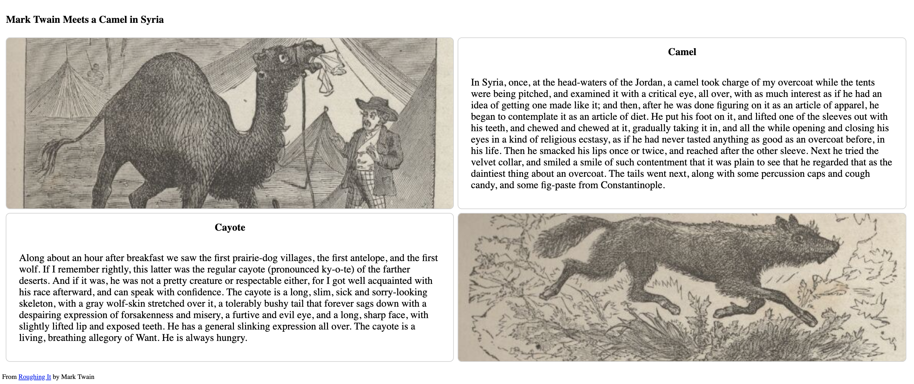

# Layout 2 Dimensional

The HTML Table is like a Spreadsheet, made up of rows and columns.  Semantically, an HTML table should only be used for tabular data.  In the early days of Web Development is was used for layout when a 2D layout was needed.  Now that is discouraged and there are other ways to achieve the 2D layout.  We'll study the `display:grid` layout  in a future module.  For this assignment we'll use a CSS3 property named `table-layout` to achieve a 2D layout without violating semantic intentions.

We'll create a 2x2 table (2 rows each with 2 columns).

Row 1 Col 1 will display a picture using a background image for the table cell.

Row 1 Col 2 will display text accompanying the picture.  

Row 2 Col 1 will display text accompanying a picture.

Row 2 Col 2 will display text accompanying the picture in Row 2 Col1.  

An index.html will content is provided and class names has been provided.  The images that will be used are in an images folder.  The index.html has divs that with id's that will be used to load the images as background content.

The structure of the html provided is
main  
-- section  
----h1  
----table  
------div "row"  
--------div "col"  
--------div "col"  
----------h2  
----------p  
------div "row"  
--------div "col"   
----------h2   
----------p  
--------div "col"  
footer  

## Requirements
1. Add a css/style.css file to set up the CSS table.  The fixed table layout tells the browser to detemine width of cells based on first row in table.  The border collapse set to separate leaves a gap between cells int he table and border spacing sets it to 10 pixels.
```
.table {
  display: table;
  height: 100%;
  width: 100%;
  table-layout: fixed;
  border-collapse: separate;
  border-spacing: 10px;
}
```

see https://www.w3schools.com/cssref/pr_tab_table-layout.asp

2. Add the table-row display to the `row` class selector.
```
.row {
  display: table-row;
}
```
3. Add the table-cell display to the `col` class selector.  In addition set up a border with curved corners and a height of 100%.
```
.col {
  display: table-cell;
  border: 1px solid lightgray;
  border-radius: 10px;
  height: 100%;
}
```
4. Using the backgound properties that control size, position and repeat, the background or 2 of the `col` divs is setup to render an image from the images directory
```
#camel-img {
  background: url("../images/camel.jpg");
  background-size: cover;
  height: 100%;
  background-position: center right;
  background-repeat: no-repeat;
}
#cayote-img {
  background: url("../images/cayote.jpg");
  background-size: cover;
  height: 100%;
  background-position: center right;
  background-repeat: no-repeat;
}
```
5. Provide some style for the text in the column paragrphs.  
```
.col p {
  padding: 20px 30px;
  font-size: 1.5rem;
}
```
6. Proivde some style for the header.
```
h2 {
  text-align: center;
}
```

## Resources


https://www.w3schools.com/CSSref/pr_tab_table-layout.asp  

https://www.w3schools.com/cssref/pr_border-collapse.asp

## Solution
