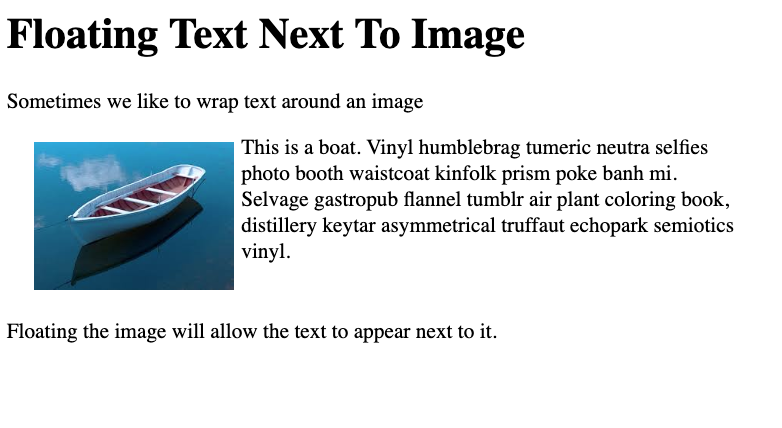

# Images Float Text

Images are inline elements but they have a height determined in part by their natural height - that is, the number of pixels wide and high they have been cropped to.  Wecan use CSS to modify height and width with CSS as long as we maintain the natural ratio without skewing what's rendered in the browser.

While images have both qualities of inline and block, it makes sense to style them implicitly as `block` or `inline-block`.  It's also useful to pick one dimension (width or height) to set a fixed size on and then set the other to `auto` to avoid skewing the result.

If you place text next to an image it will render inline next to the bottom of the image. Sometimes we want it to render next to the top of the image and then run along side. When we want to wrap text around an image we can use the `float` property on the image.  When using the float property we want to be sure to clear it so it doesn't effect content that follows the floated content.  We've seen this done by setting overflow: hidden in an earlier assignment.  In this assignment we'll use the clearfix "trick" which write empty content after the container that contains floated content.

## Requirements

1. Add a style sheet to the project and link to index.html.
2. Add a class named **"wrapped"** to the `div` container that is the parent to the image and the paragraph we want to wrap around it. 
3. Style the container. Create a horizontal width for the wrapped content such that it takes up 25% of the viewable page and sets height to auto.  We'll float the image to the left and so we need to align the text to the left and provide a margin.
```
.wrapped {
  width:25%;
  height: auto;
  text-align: left;
  margin: 1rem;
}
```
4. Style the image.  Make the image a block element and float it to the left.  Set the width of the image to a fixed pixel size and let the height adjust to maintain ratio by setting it to auto.  Add some padding.
```
.wrapped img {
  display: block;
  float: left;
  padding: 5px;
  width:150px;
  height: auto;
}
```
5.  Apply the clearfix style to the wrapped class using the `:after` pseudo selector.  By applying block content after the "wrapped" div and a `clear:both` instruction, we clear both right and left floats in the container. We've used `overflow:hidden` to clear a float in the horizontal-layout exercise.  Clearfix is an alternative method.
```
.wrapped:after {
  content: " "; 
  visibility: hidden;
  display: block;
  height: 0;
  clear: both;
}
```

## Resources
Read about clearfix here: https://css-tricks.com/snippets/css/clear-fix/

## Solution

 


