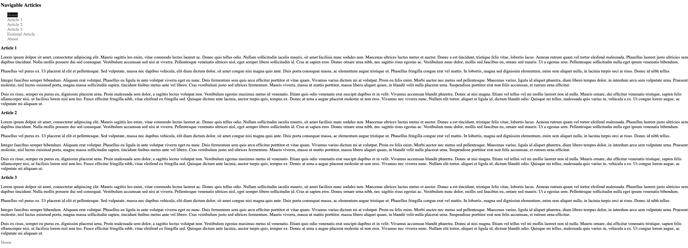
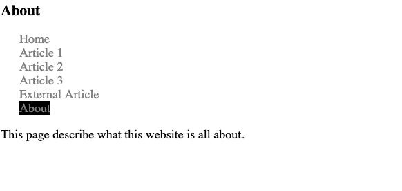

# Web Linking
## Setting up Internal and External Navigation Links

### Links
Links are set up using the anchor tag.  The "href" attribute is the place to add the location of the content to link to. Where else do we see the "href" attribute? The "target" attribute allows you to specify an alternative window for the link to open into. The value "_blank" opens a new tab in most browsers. There are some pseudo selectors for the anchor tag that provide ability to style based on user interactivity.  

In this exercise we will establish a home page with multiple internal links to articles on the page.  We'll provide a link to an "about" page that is within this domain and we'll add a link to an external web page running under a different domain.

We'll use relative linking for pages within this website (domain) and absolute linking for external pages.  There is a root relative path which for our home page would be `/index.html`. This path indicates that we always find our file in the root of the Domain.  Since we are rendering to github.io under our repo name we don't want to use root relative as we always want to pull relative to the repo name not the Domain name.

The home pages is more than a screen width long so we'll provide a link at the bottom of the home page that takes us to the top of the page when clicked.

We'll provide some styles that take advantage of anchor pseudo selectors and we'll set an active class on the navigation link for the page we're on.

We'll use the same navigation set of links on both pages, but they will be different based on the link with the class "active".


#### Setting up internal and external navigation

1. On the index.html add an id to each of the three article using "article1", "article2", and "article3".
2. Add `href` attibutes to all of the anchor tags in the nav.  The internal links should use id selectors like "#article1".  The external link to the about page should use a relative link like "./about.html".  The "dot slash" indicates that navivation starts in the current directory. The home directory can use "./index.html". You could also leave the "dot slash" off, but using it makes it more explicit. The External Article link should use a full "https://en.wikipedia.org/wiki/Article" for the href attribute.
3. Copy the nav chunk of html on to the about.html page so all pages in the site have the same navigation. For the index.html internal links on the about page, preface them with the page like this "./index.html#article1".
4. Add a class "active" to the Home link on index.html and the About link on about.html.
5. Create a css folder and add a style.css to the project and both the index.html and about.html.
6. Add the active class to the css making the active class render with a black backgournd and white text.
```
a.active {
  color: white;
  background-color: black;
}
```
7. At the bottom of the page you want to provide a link that will take you home. If you use `""` for your href it causes the page to refresh which will take you home.
```
 <p><a href="">Home</a></p>
```
<p>Try out your navigation to see if it works as required</p>

#### Anchor tag styling
1. Set the four anchor tag pseudo selectors to cover default, visited, active and hover states.  Look at the rendered code and test the linking
```
a {
  color: black
}
a:visited {
  color: gray;
}
a:active {
  background-color: yellow;
}
a:hover {
  color:red;
}
```


## Resources
see [html links](https://www.w3schools.com/html/html_links.asp)  
and [target attribute](https://www.w3schools.com/tags/att_a_target.asp)

## Solution  
### index.html  
  
### about.html  


