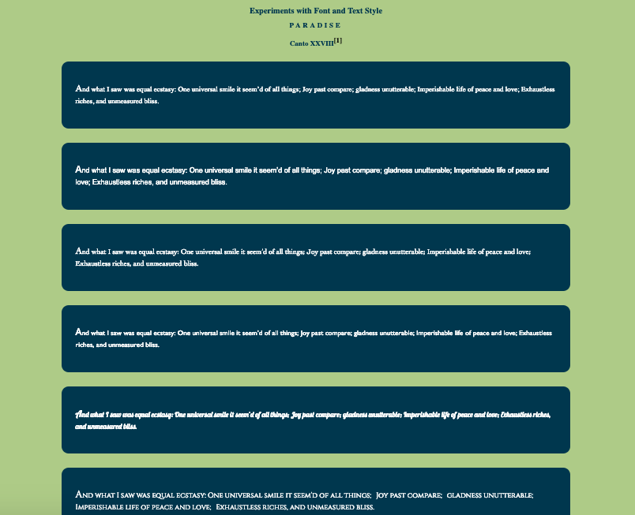

# Fonts and Text

For text we are interested in typography.  Much of our content is text and we have usability and accessbility concerns.

Designers have a set of priniciples that help with this.  See
https://saylordotorg.github.io/text_business-information-systems-design-an-app-for-that/s07-01-c-r-a-p-principles-of-graphic-.html

We'll look at fonts and CSS for styling text.  We'll also look at color as contrast is the first principle of design.

## Color
We've already been working with color and background-color properties.  It's important to maintain a contrast and there are online tools to check color contrast.  

There are multiple ways to specify color on the Web:
  - by name like `black` and `white`
  - by Hex in which we provide hex balues (0-F) specifying the range of no light to full light for the colors Red, Green and Blue. For example 
    - `black` is `#000000` indicating the absense of light
    - `white` is `#ffffff` indicating full light
    - `red` is `#ff0000` indicating full red light
    - `green` is `#00ff00` indicating full green light
    - `blue` is `#0000ff` indicating full blue light
  - by RGB in which we provide values for Red, Green, and Blue using arange of 0-255 and an optional value for opacity
    - `black` is rgb(255,0,0)
    - `white` is rgb(255,255,25)
    - `red` is rgb(255,0,0) 
    - `green` is rgb(0,255,0) 
    - `blue` is  rgb(0,0,255)
    - a translucent white could be specified with a fractionaly opacity like rgb(255,255,255,.5)
  - HSB which uses hue, saturation and brightness

Besides contrast it's important to consider accessbility issues like color blindess and visual disabilities.  There are tools for testing color for color blindess and font-size.

see for color blindness https://www.toptal.com/designers/colorfilter/
see for fonts http://www.pagecolumn.com/tool/fonteasy.htm

See https://www.w3schools.com/cssref/css_colors_legal.asp 

Contrast Checker https://contrastchecker.com/

## Alignment and Proximity
The way in which text is aligned and grouped together can affect how difficult or easy it is for the human eye to process.  Layout properties, including margin, padding, font-size and line-spacing can help with this.

## Fonts
Fonts can be downloaded or linked to.  Some of them are licensed for use for free and some are licensed and requirement payment.

The browser comes with default (safe) fonts and can be set using the font family property in CSS.  The `font-family` propoperty is configured by specifying the font you want and if the browser can't find it a safe font, and if for some reason that's not available you can choose between *serif* and *sans-serif*.  The word *serif* means hook, so the fonts with "hooks" in them are "serif" and the fonts without hooks are "sans-serif".

### Requirements

Exeripment with fonts and text styling by implementing the following.

1. Add a style sheet to the project.
2. There is a single article in the html.  Make 6 copies.  For each article apply a different font such that there are:
  - 2 built in serif fonts
  - 2 build in sans serif fonts
  - 2 fonts using CDN from google fonts
    - follow these instructions to get google fonts: [Google Fonts Getting Started](https://developers.google.com/fonts/docs/getting_started)
3. Add a link to the superscript so that it navigates to the attribution in the footer.
4. Use this color scheme:
  - body background color #b5c678
  - article background color #0c374d
  - header color: #0c374d
5. Set default font size to 1.3rem
6. Set article margin to T:2rem R:10% B:2rem L:10%
7. Set article padding to 2rem
8. For headers, aling the text to center
9. For h2 increates letter spacing to .3rem
10. For the super script style the underline away and make the text black with a red hvoer. Set the font size to 1rem.
11. For the article set the margin to 3rem.
12. Set the first letter of each article to a font size of 3rem.
13.  The footer should appear black with no underlines for links and appear gray on hover.

superscript
hr
rems
2 built in serif fonts
2 build in sans serif fonts
2 fonts using CDN from google fonts

see https://uxplanet.org/10-tips-on-typography-in-web-design-13a378f4aa0d
https://www.w3schools.com/cssref/css_websafe_fonts.asp

 https://fonts.google.com/
    
    https://www.w3schools.com/css/css_pseudo_elements.asp

### Final Image

